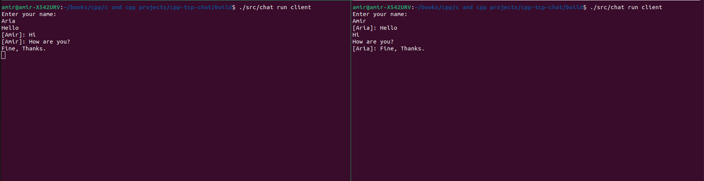

# tcpchat

A small TCP chat application and CLI frontend written in C++ for Linux.
It uses TCP sockets, a line-based protocol, `poll`, and `signalfd`.

## Screenshot



## Build

Create a build directory and compile the project with CMake:
```bash
mkdir build
cd build
cmake ..
make
```

## Features

- Uses TCP sockets for client-server communication.
- Includes a set of small wrappers around Linux socket-related system calls with clearer error reporting.
- Comes with a broad set of tests to make the program's behavior more precise and easier to verify.
- Uses a `\n`-delimited protocol and a compacting buffer for incremental message processing.
- Supports clean shutdown through `signalfd`.
- Provides a simple command-line frontend built with `CLI11`.
- Runs in a single thread and uses `poll` to manage events.

## Run

Start the server in the background:
```bash
./src/chat run server &
```

Start a client in another terminal:
```bash
./src/chat run client
```


